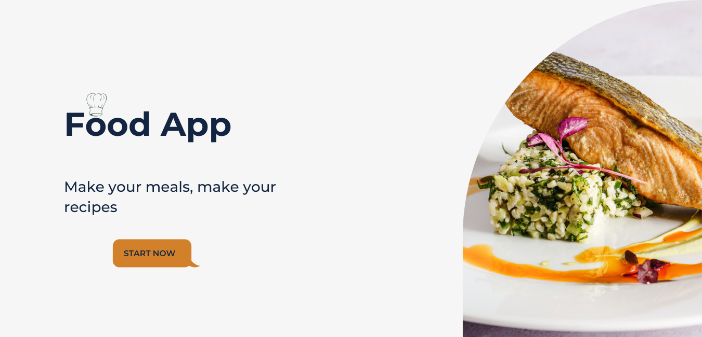
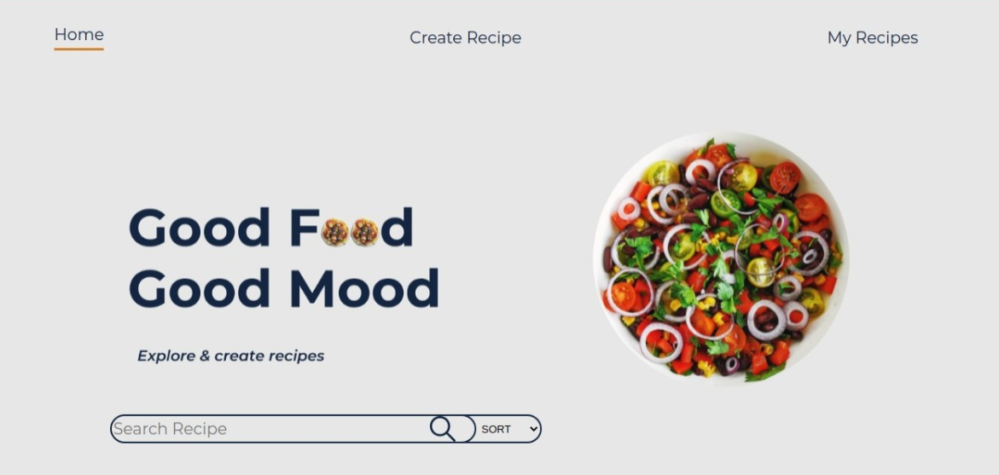
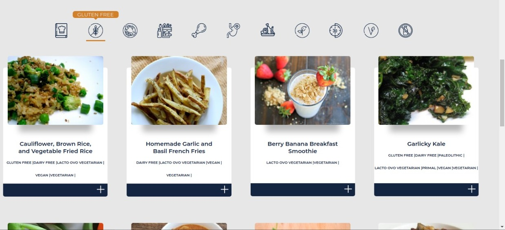
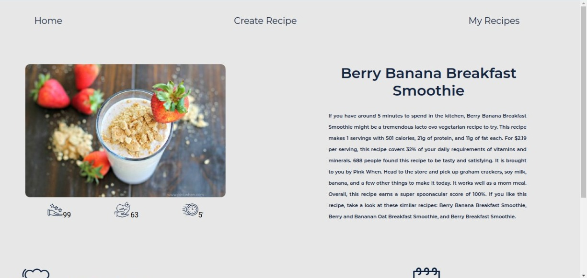
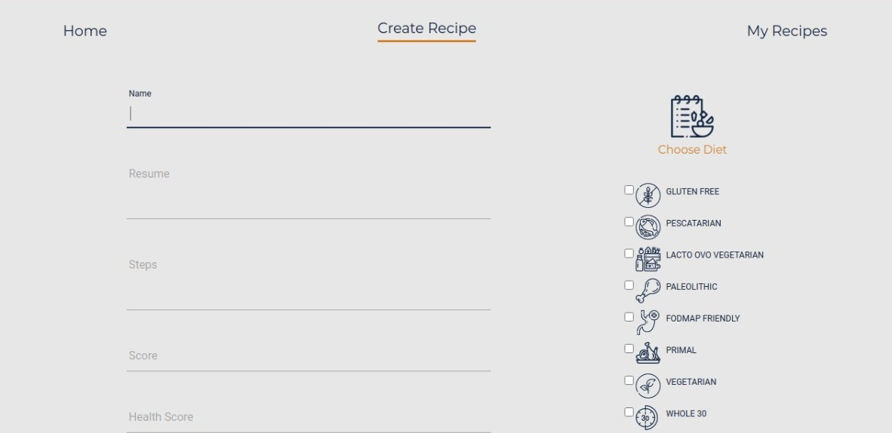

  

# Presentacion
:wave: Super agradecido de que estes en mi espacio de trabajo personal, contarte que de muy chico soy apasionado del mundo IT, siempre tratando de superar mis propias expectativas, con educación y trabajo en equipo puedo decir que las estoy cumpliendo. En esta presentación voy a expresarte algunos de mis proyectos que he estado realizando. Espero que te se sean de gran aporte :100:  

## Food App 
#### Repositorio:(mircogrosch/Food-App encontraras información detallada)
##### Landing

  

##### Home

  

##### Cards

  

##### DETALLE CARD

  

##### FORM CREAR RECETAS

  

